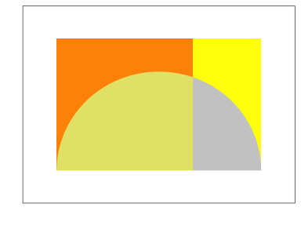
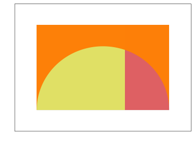
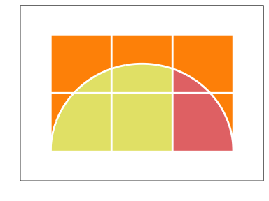

Crocket Johnson Inspired Math Art
================

Square Root of Two
------------------

Inspiration [here](https://americanhistory.si.edu/collections/search/object/nmah_694637).

First, let's get a canvas.

``` r
library(tidyverse)
plt <- 
  ggplot() +
  coord_cartesian(xlim   = c(-0.5,3.5),
                  ylim   = c(-0.5,2.5),
                  expand = FALSE) +
  scale_x_continuous(name = '', labels = NULL) +
  scale_y_continuous(name = '', labels = NULL) +
  theme_bw() +
  theme(panel.grid.major = element_blank(),
        panel.grid.minor = element_blank(),
        axis.line        = element_blank(),
        axis.ticks       = element_blank()) 
plt
```


Add some rectangles with the first and second color.

``` r
# reusable values
color1 <- 'red'
color2 <- 'yellow'
rectmap1 <- aes(xmin = 0, xmax = 2, ymin = 0, ymax = 2)
rectmap2 <- aes(xmin = 2, xmax = 3, ymin = 0, ymax = 2)
# add to plot
plt <- plt + geom_rect(mapping = rectmap1, alpha = 1, fill = color1, color = NA) +
  geom_rect(mapping = rectmap2, alpha = 1, fill = color2, color = NA)
plt
```


Next, we need a semi-circle.

``` r
crcl <- tibble(r = seq(0, 180, 0.2)*pi/180,
               x = 1.5*cos(r) + 1.5,
               y = 1.5*sin(r) )
plt <- plt + geom_polygon(mapping = aes(x = x, y = y), data = crcl, fill = 'gray80') 
plt
```


Overlay the first transparent rectangle.

``` r
plt <- plt + geom_rect(mapping = rectmap1, alpha = 0.5, fill = color2, color = NA)
plt
```



Overlay the second transparent rectangle.

``` r
plt <- plt + geom_rect(mapping = rectmap2, alpha = 0.5, fill = color1, color = NA)
plt
```



Add some lines to make it look real nice.

``` r
plt <- plt + geom_line(mapping = aes(x = x, y = y), data = crcl, color = 'white', size = 1) +
  geom_vline(xintercept = 0:3, size = 1, color = 'white') +
  geom_hline(yintercept = 0:3, size = 1, color = 'white')
plt
```


