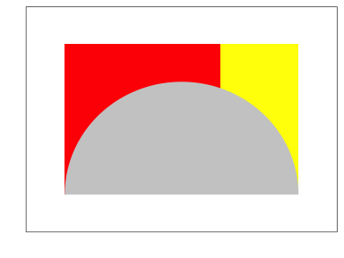

Crocket Johnson Inspired Math Art
================

Square Root of Two
------------------

Inspiration [here](https://americanhistory.si.edu/collections/search/object/nmah_694637).

First, let's get a canvas.

``` r
library(tidyverse)
```

    ## ── Attaching packages ───────────────────────────────────────────────────────────────────── tidyverse 1.2.1 ──

    ## ✔ ggplot2 2.2.1     ✔ purrr   0.2.4
    ## ✔ tibble  1.4.2     ✔ dplyr   0.7.4
    ## ✔ tidyr   0.8.0     ✔ stringr 1.3.0
    ## ✔ readr   1.1.1     ✔ forcats 0.3.0

    ## ── Conflicts ──────────────────────────────────────────────────────────────────────── tidyverse_conflicts() ──
    ## ✖ dplyr::filter() masks stats::filter()
    ## ✖ dplyr::lag()    masks stats::lag()

``` r
plt <- 
  ggplot() +
  coord_cartesian(
    xlim   = c(0,3),
    ylim   = c(0,2),
    expand = FALSE
  )
plt
```


Next, we need a semi-circle.

``` r
crcl <-
  tibble(
    r = seq(0, 180, 1)*pi/180,
    x = 1.5*cos(r) + 1.5,
    y = 1.5*sin(r)
  )
plt <-
  plt +
  geom_polygon(aes(x = x, y = y), crcl)
plt
```


