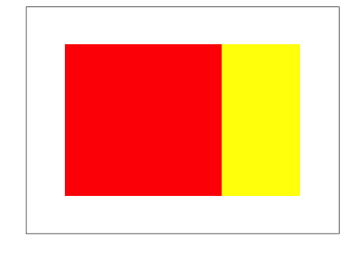

Crocket Johnson Inspired Math Art
================

Square Root of Two
------------------

Inspiration [here](https://americanhistory.si.edu/collections/search/object/nmah_694637).

First, let's get a canvas.

``` r
library(tidyverse)
plt <- 
  ggplot() +
  coord_cartesian(
    xlim   = c(-0.5,3.5),
    ylim   = c(-0.5,2.5),
    expand = FALSE
  ) +
  scale_x_continuous(name = '', labels = NULL) +
  scale_y_continuous(name = '', labels = NULL) +
  theme_bw() +
  theme(panel.grid.major = element_blank(),
        panel.grid.minor = element_blank(),
        axis.line        = element_blank(),
        axis.ticks       = element_blank()) 
plt
```


Add some red and blue rectangles

``` r
plt <-
  plt +
  geom_rect(mapping = aes(xmin = 0, xmax = 2, 
                          ymin = 0, ymax = 2),
            alpha   = 1,
            fill    = 'red',
            color   = NA) +
  geom_rect(mapping = aes(xmin = 2, xmax = 3, 
                          ymin = 0, ymax = 2),
            alpha   = 1,
            fill    = 'yellow',
            color   = NA)
plt
```



Next, we need a semi-circle.

``` r
crcl <-
  tibble(
    r = seq(0, 180, 1)*pi/180,
    x = 1.5*cos(r) + 1.5,
    y = 1.5*sin(r)
  )
plt <-
  plt +
  geom_polygon(aes(x = x, y = y), crcl, fill = 'gray80') 
plt
```


Overlay the first transparent rectangle.

``` r
plt <-
  plt +
  geom_rect(mapping = aes(xmin = 0, xmax = 2, 
                          ymin = 0, ymax = 2),
            alpha   = 0.5,
            fill    = 'yellow',
            color   = NA)
plt
```


Overlay the second transparent rectangle.

``` r
plt <-
  plt +
  geom_rect(mapping = aes(xmin = 2, xmax = 3, 
                          ymin = 0, ymax = 2),
            alpha   = 0.5,
            fill    = 'red',
            color   = NA)
plt
```


Add some lines to make it look real nice.

``` r
plt <-
  plt +
  geom_line(mapping = aes(x = x, y=y),
            data    = crcl,
            color   = 'white',
            size    = 1) +
  geom_vline(xintercept = 0:3, size = 1, color = 'white') +
  geom_hline(yintercept = 0:3, size = 1, color = 'white')
plt
```


