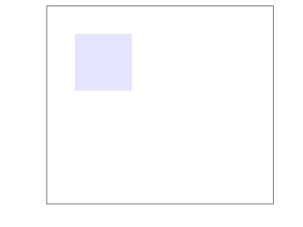
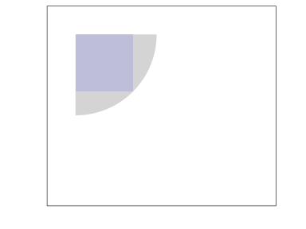

Squares
================

A square
--------

``` r
library(tidyverse)
```

    ## ── Attaching packages ──────────────────────────────────────────────────────────────────────────────────────────── tidyverse 1.2.1 ──

    ## ✔ ggplot2 2.2.1     ✔ purrr   0.2.4
    ## ✔ tibble  1.4.2     ✔ dplyr   0.7.4
    ## ✔ tidyr   0.8.0     ✔ stringr 1.3.0
    ## ✔ readr   1.1.1     ✔ forcats 0.3.0

    ## ── Conflicts ─────────────────────────────────────────────────────────────────────────────────────────────── tidyverse_conflicts() ──
    ## ✖ dplyr::filter() masks stats::filter()
    ## ✖ dplyr::lag()    masks stats::lag()

``` r
canvas <-
  ggplot() +
  coord_equal(xlim   = c(-0.5,3.5),
              ylim   = c(-3  ,0.5),
              expand = FALSE) +
  scale_x_continuous(name = '', labels = NULL) +
  scale_y_continuous(name = '', labels = NULL) +
  theme_bw() +
  theme(panel.grid.major = element_blank(),
        panel.grid.minor = element_blank(),
        axis.line        = element_blank(),
        axis.ticks       = element_blank()) 
sqr1 <-  
  geom_rect(aes(ymax =  0, xmin =  0, xmax = 1, 
                ymin = -1),
            alpha = 0.1,
            fill = 'blue')
canvas + sqr1
```



A circle
--------

``` r
library(tidyverse)
unit_crcl <- tibble(r = seq(0, 90, 0.2)*pi/180,
                    x =  cos(r),
                    y = -sin(r) )
crcl1 <-  
  geom_area(aes(x=x*sqrt(2), y=y*sqrt(2)), 
            unit_crcl,
            alpha = 0.2)
canvas + crcl1 + sqr1
```


